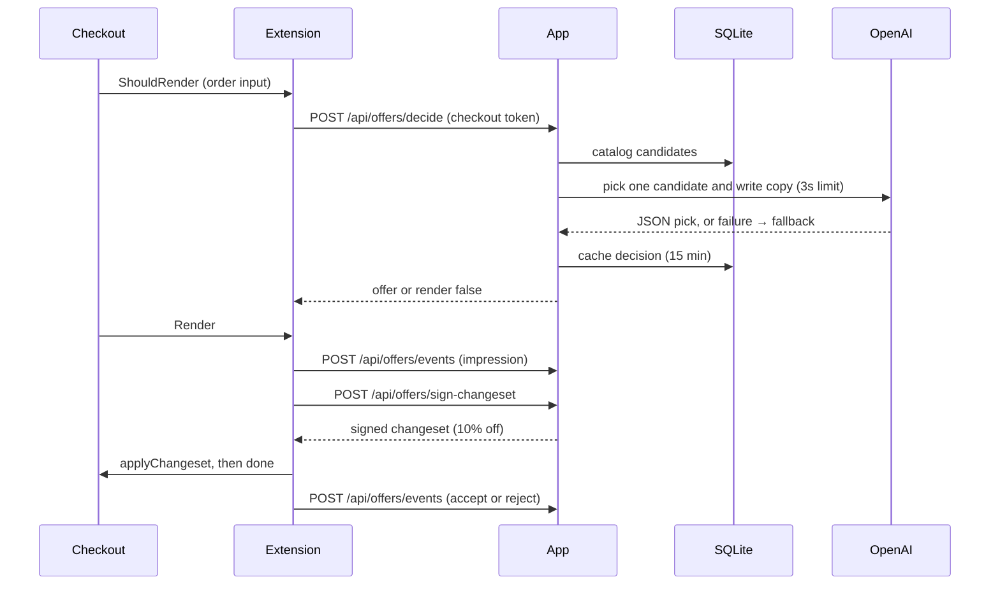

# Grüns post-purchase upsell

A Shopify app that shows one personalized offer on the post-purchase page, after payment and before the order status page. The app reads the completed order, filters a small catalog down to complementary products, and asks an LLM to pick one of them and write the pitch. If the model is slow, missing, or returns something invalid, a deterministic fallback picks instead. The buyer adds the offer with one click at 10% off. The app records every impression, accept, and decline and shows the results in an embedded admin page.

Built on the Shopify CLI React Router template (TypeScript, Prisma, SQLite) with the official post-purchase checkout extension.

## Demo store

- Store: `gruns-quinn-upsell.myshopify.com` (Partner development store, test data on, Bogus Gateway)
- Catalog: 10 seeded Grüns products from $18 to $79, tagged by use (`daily`, `kids`, `sleep`, `fiber`, `gut`, and others)
- Verified on Sep 22, 2026 through a normal storefront checkout (collection → product page → cart → checkout):
  - Daily Gummies → LLM offered Fiber Gummies → declined, reject recorded
  - Another Grüns cart → LLM offered Travel Packs → accepted, and the order gained a Travel Packs line at $16.20
  - `OPENAI_API_KEY` removed → the fallback offered Magnesium Night and Travel Packs, and both were recorded as `fallback`
  - App server stopped → checkout went straight to the order status page with no error

## Setup

You need Node 20.19+ (or 22.12+), the [Shopify CLI](https://shopify.dev/docs/apps/tools/cli/getting-started), a [Partner account](https://partners.shopify.com/signup), and a development store. Post-purchase extensions run without restrictions on development stores. An OpenAI API key is optional, because the fallback works without it.

### 1. Install and connect

```bash
npm install
shopify app config link        # pick or create an app in your Partner org
shopify app env pull           # writes SHOPIFY_API_KEY, SHOPIFY_API_SECRET, SCOPES to .env
```

Add the rest of the values from `.env.example` to `.env`:

```bash
OPENAI_API_KEY=sk-...          # optional; without it every offer uses the fallback
SHOP=your-store.myshopify.com  # used by the seed script and the app URL publisher
```

### 2. Point the extension at your app's metafield namespace

The extension reads a shop metafield that holds the current app URL. See [Runtime app URL](#runtime-app-url) for why. It must name the namespace using your app's numeric id. `extensions/post-purchase-offer/shopify.extension.toml` has this repo's id:

```toml
[[metafields]]
namespace = "app--426350608385"
key = "app_url"
```

Replace `426350608385` with your app id. It is the number in your app's Dev Dashboard URL (`dev.shopify.com/dashboard/<org>/apps/<app id>`). Skip this step if you linked to this repo's existing app.

### 3. Run the app and install it

```bash
shopify app dev --store your-store.myshopify.com
```

Keep this terminal running. The app server runs here, and checkout calls it through the tunnel the CLI prints.

**Wait for this line before you press `p` or check out:**

```text
[offers] Ready. Storefront checkouts will show the offer through https://….trycloudflare.com
```

Each `shopify app dev` start gets a new `trycloudflare.com` hostname, and the name takes a few seconds to appear in DNS. If a browser looks it up during that gap, the machine caches "does not exist" for up to 30 minutes, and in that time checkout silently skips the offer. A small Vite plugin (`scripts/offer-readiness-plugin.ts`) handles startup instead:

1. It waits until Cloudflare's own nameservers serve the new hostname. Those servers don't cache, so polling them can't cache a miss on your machine.
2. It saves the new URL to the shop metafield the extension reads.
3. It checks that checkout requests reach the app through the tunnel, then prints `Ready`.
4. It rechecks every 30 seconds and prints a `Not ready` line with the fix if the tunnel drops.

On first install, press `p` to install the app. Saving the URL keeps retrying until the install finishes.

To check the same things from another terminal at any time:

```bash
npm run demo:check
```

### 4. Seed the catalog

In a second terminal:

```bash
SHOPIFY_APP_URL=https://example.com npm run seed
```

This creates or updates the 10 Grüns products through the Admin API with the installed app's offline session. It also writes matching rows to the local `CatalogProduct` table. `SHOPIFY_APP_URL` only needs to be non-empty for the library to start; the seed doesn't use it. Products are created with untracked inventory, so they never sell out.

Then, in Shopify admin:

1. **Products:** select the 10 Grüns products and add them to the **Online Store** sales channel.
2. **Settings → Checkout → Post-purchase page:** select this app. A released post-purchase extension only runs after this is set.
3. **Settings → Payments:** confirm Bogus Gateway is active (it is on by default when a store has test data).
4. **Product images (optional):** add a featured image to each product, then run `npm run sync:images`. It copies each image URL into the local catalog, and the offer page shows it next to the price.

### 5. Release the extension

```bash
shopify app deploy --allow-updates
```

Before you deploy, set `application_url` and `redirect_urls` in `shopify.app.toml` to your current tunnel, because deploy publishes those values. Shopify hosts the released extension, so it loads on every Online Store checkout. The deploy doesn't host the app server; `shopify app dev` still has to be running. Redeploy only when extension code changes. Tunnel changes don't need a redeploy.

### 6. Place test orders

In the storefront (enter the store password if prompted), add **Grüns Daily Gummies** to the cart and check out:

- Use any shipping address. Post-purchase offers need one.
- Pay with Bogus Gateway, card number `1`, any future expiry, any CVV.
- Don't use Shop Pay or express wallets. The demo was only tested with Bogus Gateway card checkout.

Three orders cover the flow:

| Order    | What to do                                                                                                         | What you should see                                                                 |
| -------- | ------------------------------------------------------------------------------------------------------------------ | ----------------------------------------------------------------------------------- |
| Accept   | Click **Pay now**                                                                                                  | The order gains the offer line at 10% off. `/app` counts an accept and its revenue. |
| Decline  | Click **Decline this offer**                                                                                       | The order status page loads. `/app` counts a reject.                                |
| Fallback | Comment out `OPENAI_API_KEY`, restart `shopify app dev`, use a cart you haven't checked out in the last 15 minutes | The headline reads "Add Grüns …", and the event is recorded with model `fallback`   |

The offer is cached per product set for 15 minutes, so a repeat of the same cart replays the earlier pick.

### Tests

```bash
npm test
```

There are 19 tests using Node's built-in test runner. They don't touch Shopify or OpenAI. They cover the candidate filter and price band, complement rules, rejecting model picks that aren't in the candidate list, the fallback when the provider throws, the 10% price math, the signed changeset ignoring client input, shop resolution when the checkout token has no `dest`, event input validation, analytics totals, and app URL selection.

`npm run typecheck` covers the app, scripts, and tests. The extension's `.tsx` is left out of it: `@shopify/post-purchase-ui-extensions-react` brings its own copy of React's types through `@remote-ui/react`, and those types conflict with the app's. The Shopify CLI builds the extension with esbuild on every `shopify app dev` and `shopify app deploy`, and `app-url.ts` is still typechecked through its test.

## Architecture



| Path                                                                 | Responsibility                                                                                                                                              |
| -------------------------------------------------------------------- | ----------------------------------------------------------------------------------------------------------------------------------------------------------- |
| `extensions/post-purchase-offer/src/index.tsx`                       | `ShouldRender` asks the app for an offer and stores it. `Render` shows it, gets prices from `calculateChangeset`, and handles accept, decline, and failure. |
| `extensions/post-purchase-offer/src/app-url.ts`                      | Picks the app origin at runtime                                                                                                                             |
| `app/routes/api.offers.decide.ts`                                    | Checkout-authenticated decide endpoint                                                                                                                      |
| `app/offers/decide.server.ts`                                        | Gate, candidates, cache, model call, fallback                                                                                                               |
| `app/offers/candidates.ts`                                           | Pure offer logic (filter, complement rules, fallback, validating model picks)                                                                               |
| `app/offers/llm.server.ts`                                           | The only file that knows about OpenAI                                                                                                                       |
| `app/routes/api.offers.sign-changeset.ts`, `app/offers/changeset.ts` | Loads the offer from the catalog and signs the 10% changeset                                                                                                |
| `app/routes/api.offers.events.ts`, `app/offers/events.server.ts`     | Impression, accept, and reject events                                                                                                                       |
| `app/routes/app._index.tsx`, `app/offers/analytics.ts`               | Embedded admin analytics                                                                                                                                    |
| `app/offers/publish-app-url.server.ts`                               | Writes the current tunnel into the shop metafield                                                                                                           |
| `scripts/seed-catalog.ts`                                            | Seeds Shopify products and the local catalog                                                                                                                |
| `prisma/schema.prisma`                                               | `CatalogProduct`, `OfferDecision`, `OfferEvent`, plus the template's `Session`                                                                              |

### How an offer is chosen

1. **Gate.** Skip orders under $0.50, which Shopify won't show an offer on anyway. A missing shipping address doesn't block the offer, because `ShouldRender` can run before the buyer enters one.
2. **Filter.** Rules decide which products are allowed. Candidates must not already be in the order, must be available, and must cost at most 60% of the order subtotal. Complement rules narrow the list: `kids` → immunity, `sleep` → magnesium, `daily` → fiber, travel, or sleep. If nothing fits the price band, keep the cheapest complement and mark the band as relaxed.
3. **Pick.** The model gets only the candidates (id, title, price, tags, one-line blurb) and the purchased titles. It returns strict JSON: `{ variantId, reason, headline, body }`. The app discards any `variantId` that isn't in the candidate list.
4. **Fallback.** On a timeout, an error, a missing key, or an invalid pick, choose the complement with the highest margin, or the cheapest candidate if no complement matched. Fixed copy names the purchased product.

A $79 Daily Gummies order has three complements in the band (Fiber, Travel, Sleep), so the model makes a real choice. Cheaper single-product orders often narrow to one candidate, and then the model only writes the copy.

### Analytics

`/app` shows impressions, accept rate (accepts ÷ impressions), and estimated incremental revenue. Revenue is the sum of the discounted price of each accepted offer, excluding shipping and tax. A table ranks offers by revenue, then accepts. Each `OfferEvent` also stores the model (`gpt-4o-mini` or `fallback`) and its one-line reason, so you can see which picks came from the LLM. The extension sends the order's product ids with each event, and the server uses them to look up the exact decision made for that product set. Events recorded after that decision expires, or whose decision picked a different product, are labeled `unknown`.

## Key decisions

**The discount is signed on the server.** The extension never sends a price or a discount. It sends the order's reference id, the product ids in the order, and the variant it was offered. `sign-changeset` looks up the decision the server made for that exact product set, and refuses (403) unless the variant matches. It then builds the `add_variant` change with a 10% percentage discount and signs it with the app secret. A tampered request can't choose a different product or a different price.

**The LLM only chooses from what the rules allow.** Rules handle what must be true: in stock, not already bought, a sensible price, a complementary category. The model handles what rules do badly: choosing among good options and writing a pitch that names what the buyer just bought. It can't invent a product, and when it fails the checkout still gets a reasonable offer.

**The catalog lives in SQLite.** Line items in post-purchase input don't include product tags, and `ShouldRender` has little time to work with. The decide path joins product ids to a local catalog instead of calling the Admin API in the middle of checkout. Shopify's numeric ids are stored as strings because Prisma `Int` is 32-bit.

**Checkout can never get stuck.** Every call from the extension to the app aborts at 4 seconds, and the server's model call aborts at 3. Any error, timeout, or non-OK response means `render: false`. A failed accept shows a banner and continues to the order status page. The worst case is a normal checkout with no offer.

### Runtime app URL

The tutorial hardcodes the app URL in the extension, but `shopify app dev` gets a new tunnel on every restart. Here the extension resolves the URL at runtime:

1. When the script is loaded from a non-Shopify host (a dev preview link), it uses that origin.
2. Otherwise it reads the shop metafield `app_url`. The dev server writes the current tunnel URL into it at startup, once the tunnel is live.
3. If neither exists, it doesn't render.

The metafield needs Storefront `public_read` access, because post-purchase input only includes storefront-readable metafields. With this setup, the released extension works across tunnel restarts without a redeploy.

## What I'd do differently with more time

- **Confirm accepts on the server.** Today the extension reports the accept after `applyChangeset` succeeds. I'd confirm it from `orders/edited` or `orders/updated` webhooks, and only count revenue Shopify has recorded.
- **Keep the catalog current.** Subscribe to `products/update` and inventory webhooks instead of seeding. Store margin as merchant-editable metafields rather than seed data.
- **Measure real lift.** Hold out a share of orders with no offer, and compare offer-shown orders with the holdout on revenue per order. Then compare the LLM against the fallback on accept rate.
- **Move the model off the checkout path.** Precompute a decision per product set and refresh it in a queue, so `ShouldRender` reads from a cache and never waits on the model. Add idempotency keys to events and a budget for spend and latency.
- **Add guardrails for the copy.** Check headlines against brand and health-claim rules before they reach a buyer.
- **Support multiple offers.** Rank a sequence up to Shopify's three-accept limit, and handle the hold/release behavior for orders with payment holds.
- **Host it.** Deploy the server (the template's Dockerfile), move from SQLite to Postgres, and set a fixed `application_url` so the metafield step goes away.

## Using another store

The seed script and URL publisher read `SHOP`. The checkout routes use the shop domain from checkout input. `app/offers/checkout-body.ts` names `gruns-quinn-upsell.myshopify.com` only as a last-resort fallback. The values specific to this repo are:

- `SHOP` in `.env`
- The metafield namespace in `extensions/post-purchase-offer/shopify.extension.toml` (your app id)
- `client_id` and `application_url` in `shopify.app.toml`. `shopify app config link` writes your `client_id`. `shopify app dev` updates the live URLs on each start, but `shopify app deploy` publishes whatever `application_url` the file holds, so set it to your current tunnel before a deploy.
